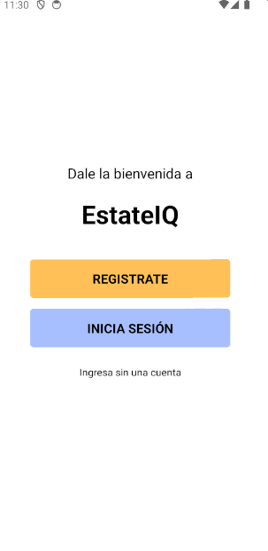

# EstateIQMovil

Este repositorio contiene la aplicación móvil de EstateIQ, una herramienta para la gestión de propiedades inmobiliarias desarrollada con React Native y Expo.

## Descripción

La aplicación móvil EstateIQ permite a los usuarios gestionar propiedades inmobiliarias desde sus dispositivos móviles. Los usuarios pueden ver una lista de propiedades, ver detalles de una propiedad específica y añadir nuevas propiedades. La aplicación se conecta a un backend desarrollado con Node.js y Express.

## Requisitos

- Node.js (versión 14 o superior)
- npm (versión 6 o superior)
- Expo CLI
- Android Studio (recomendado para emular la aplicación)

## Instalación

Sigue estos pasos para clonar y configurar el proyecto:

1. Clona el repositorio:

   ```bash
   git clone https://github.com/diegogodinezr/EstateIQMovil.git
   ```

2. Navega al directorio del proyecto:

   ```bash
   cd EstateIQMovil
   ```

3. Instala las dependencias:

   ```bash
   npm install
   ```

## Configuración del Backend

Para que la aplicación móvil funcione correctamente, primero debes configurar y ejecutar el backend de EstateIQ. Sigue estos pasos:

1. Clona y configura el repositorio del backend siguiendo las instrucciones en su [README.md](https://github.com/diegogodinezr/EstateIQ_Back).

    - Repositorio del backend: [EstateIQ_Back](https://github.com/diegogodinezr/EstateIQ_Back).

2. Una vez que el backend esté corriendo, actualiza la URL de la API en la aplicación móvil de este proyecto. Abre el archivo `api/url.js` y reemplaza `192.168.1.77` con la dirección IP de tu computadora:

   ```javascript
   export const API = 'http://<tu-ip-local>:3000/api';
   ```

## Ejecución

Una vez que hayas configurado el backend y actualizado la URL de la API, puedes ejecutar la aplicación móvil. Sigue estos pasos:

1. Asegúrate de que el backend está corriendo en `http://localhost:3000`.

2. Inicia el servidor de desarrollo de Expo:

   ```bash
   npm start
   ```

3. Presiona la tecla `a` para abrir la aplicación en un emulador de Android. Deberías ver algo similar a esto en la terminal:

   ```
   › Metro waiting on exp://<tu-ip-local>:8081
   › Scan the QR code above with Expo Go (Android) or the Camera app (iOS)
   
   › Web is waiting on http://localhost:8081
   
   › Using Expo Go
   › Press s │ switch to development build
   › Press a │ open Android
   › Press i │ open iOS simulator
   › Press w │ open web
   
   › Press j │ open debugger
   › Press r │ reload app
   › Press m │ toggle menu
   › Press o │ open project code in your editor
   
   › Press ? │ show all commands
   
   Logs for your project will appear below. Press Ctrl+C to exit.
   ```

4. Usa la aplicación Expo Go en tu dispositivo móvil o el emulador de Android para escanear el código QR que aparece en la terminal o en el navegador.

## Pantalla Principal

Al correr el repositorio, verás la siguiente pantalla principal:



Las funciones de "INICIA SESIÓN" y "REGISTRATE" aún no están completas. Para continuar, haz clic en "Ingresa sin una cuenta".

